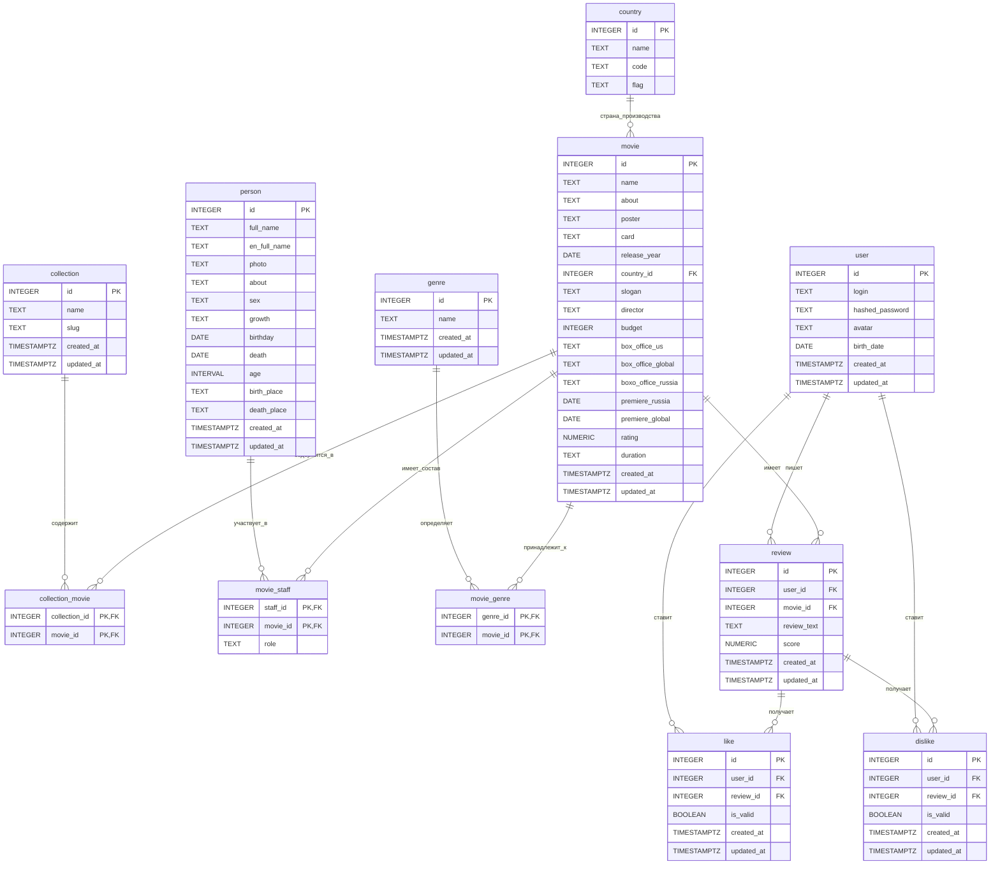

# ER Diagram

```mermaid
erDiagram
    user {
        INTEGER id PK
        TEXT login
        TEXT hashed_password
        TEXT avatar
        DATE birth_date
        TIMESTAMPTZ created_at
        TIMESTAMPTZ updated_at
    }
    collection {
        INTEGER id PK
        TEXT name
        TEXT slug
        TIMESTAMPTZ created_at
        TIMESTAMPTZ updated_at
    }
    person {
        INTEGER id PK
        TEXT full_name
        TEXT en_full_name
        TEXT photo
        TEXT about
        TEXT sex
        TEXT growth
        DATE birthday
        DATE death
        INTERVAL age
        TEXT birth_place
        TEXT death_place
        TIMESTAMPTZ created_at
        TIMESTAMPTZ updated_at
    }
    genre {
        INTEGER id PK
        TEXT name
        TIMESTAMPTZ created_at
        TIMESTAMPTZ updated_at
    }
    country {
        INTEGER id PK
        TEXT name
        TEXT code
        TEXT flag
    }
    movie {
        INTEGER id PK
        TEXT name
        TEXT about
        TEXT poster
        TEXT card
        DATE release_year
        INTEGER country_id FK
        TEXT slogan
        TEXT director
        INTEGER budget
        TEXT box_office_us
        TEXT box_office_global
        TEXT boxo_office_russia
        DATE premiere_russia
        DATE premiere_global
        NUMERIC rating
        TEXT duration
        TIMESTAMPTZ created_at
        TIMESTAMPTZ updated_at
    }
    collection_movie {
        INTEGER collection_id PK, FK
        INTEGER movie_id PK, FK
    }
    movie_staff {
        INTEGER staff_id PK, FK
        INTEGER movie_id PK, FK
        TEXT role
    }
    movie_genre {
        INTEGER genre_id PK, FK
        INTEGER movie_id PK, FK
    }
    review {
        INTEGER id PK
        INTEGER user_id FK
        INTEGER movie_id FK
        TEXT review_text
        NUMERIC score
        TIMESTAMPTZ created_at
        TIMESTAMPTZ updated_at
    }
    like {
        INTEGER id PK
        INTEGER user_id FK
        INTEGER review_id FK
        BOOLEAN is_valid
        TIMESTAMPTZ created_at
        TIMESTAMPTZ updated_at
    }
    dislike {
        INTEGER id PK
        INTEGER user_id FK
        INTEGER review_id FK
        BOOLEAN is_valid
        TIMESTAMPTZ created_at
        TIMESTAMPTZ updated_at
    }

    user                ||--o{ review           : "пишет"
    movie               ||--o{ review           : "имеет"
    user                ||--o{ like             : "ставит"
    review              ||--o{ like             : "получает"
    user                ||--o{ dislike          : "ставит"
    review              ||--o{ dislike          : "получает"
    country             ||--o{ movie            : "страна_производства"

    collection          ||--o{ collection_movie : "содержит"
    movie               ||--o{ collection_movie : "содержится_в"

    person              ||--o{ movie_staff      : "участвует_в"
    movie               ||--o{ movie_staff      : "имеет_состав"

    genre               ||--o{ movie_genre      : "определяет"
    movie               ||--o{ movie_genre      : "принадлежит_к"

    
```
