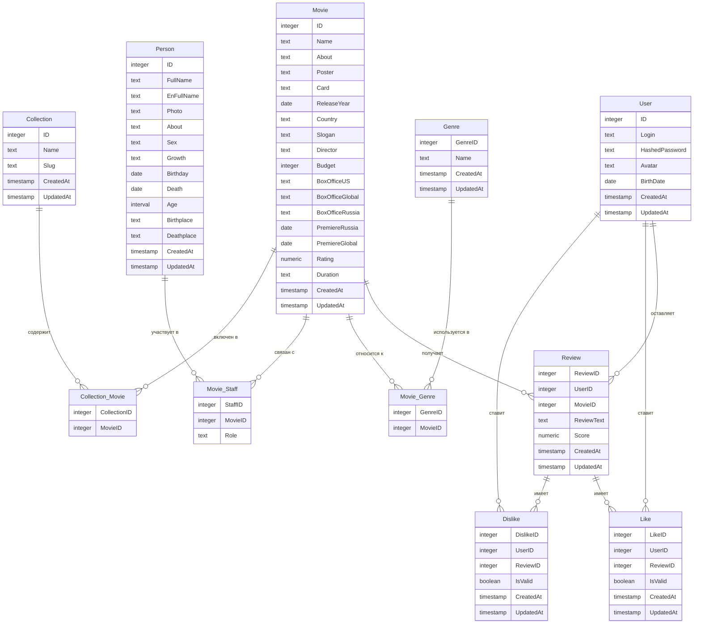

# ER-диаграмма базы данных

```mermaid
erDiagram
    User {
        integer ID
        text Login
        text HashedPassword
        text Avatar
        date BirthDate
        timestamp CreatedAt
        timestamp UpdatedAt
    }
    
    Collection {
        integer ID
        text Name
        text Slug
        timestamp CreatedAt
        timestamp UpdatedAt
    }
    
    Person {
        integer ID
        text FullName
        text EnFullName
        text Photo
        text About
        text Sex
        text Growth
        date Birthday
        date Death
        interval Age
        text Birthplace
        text Deathplace
        timestamp CreatedAt
        timestamp UpdatedAt
    }
    
    Genre {
        integer GenreID
        text Name
        timestamp CreatedAt
        timestamp UpdatedAt
    }
    
    Movie {
        integer ID
        text Name
        text About
        text Poster
        text Card
        date ReleaseYear
        text Country
        text Slogan
        text Director
        integer Budget
        text BoxOfficeUS
        text BoxOfficeGlobal
        text BoxOfficeRussia
        date PremiereRussia
        date PremiereGlobal
        numeric Rating
        text Duration
        timestamp CreatedAt
        timestamp UpdatedAt
    }
    
    Collection_Movie {
        integer CollectionID
        integer MovieID
    }
    
    Movie_Staff {
        integer StaffID
        integer MovieID
        text Role
    }
    
    Movie_Genre {
        integer GenreID
        integer MovieID
    }
    
    Review {
        integer ReviewID
        integer UserID
        integer MovieID
        text ReviewText
        numeric Score
        timestamp CreatedAt
        timestamp UpdatedAt
    }
    
    Like {
        integer LikeID
        integer UserID
        integer ReviewID
        boolean IsValid
        timestamp CreatedAt
        timestamp UpdatedAt
    }
    
    Dislike {
        integer DislikeID
        integer UserID
        integer ReviewID
        boolean IsValid
        timestamp CreatedAt
        timestamp UpdatedAt
    }
    
    User ||--o{ Review : "оставляет"
    User ||--o{ Like : "ставит"
    User ||--o{ Dislike : "ставит"
    Review ||--o{ Like : "имеет"
    Review ||--o{ Dislike : "имеет"
    Movie ||--o{ Review : "получает"
    Movie ||--o{ Movie_Genre : "относится к"
    Movie ||--o{ Movie_Staff : "связан с"
    Movie ||--o{ Collection_Movie : "включен в"
    Genre ||--o{ Movie_Genre : "используется в"
    Person ||--o{ Movie_Staff : "участвует в"
    Collection ||--o{ Collection_Movie : "содержит"
```

